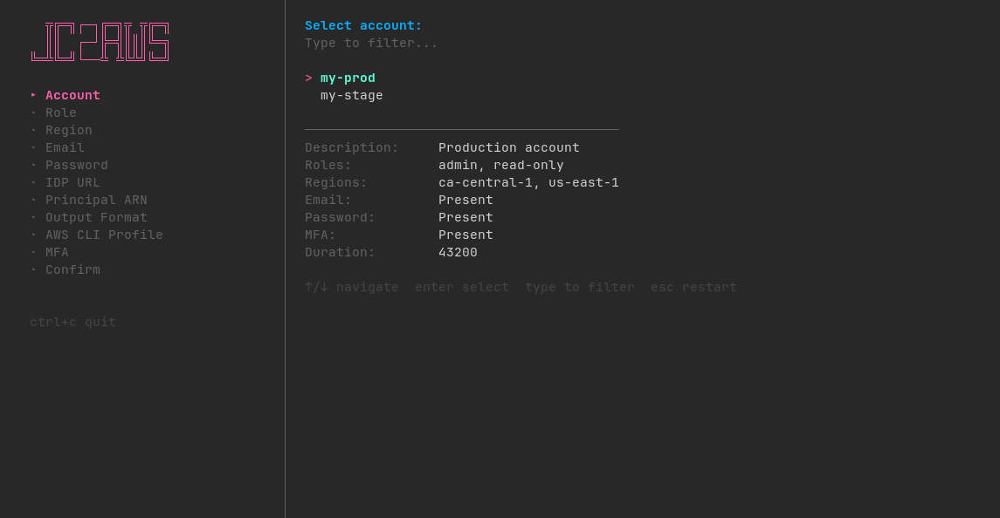

# jc2aws
CLI tool for getting temporary AWS credentials via Jumpcloud SSO (SAML)



[](https://github.com/vshymanskyy/StandWithUkraine/blob/main/docs/README.md)

## Features:
- Support fully automated auth including MFA token generation
- Support manual (default), interactive and mixed modes
- Output credentials as AWS CLI profile or environment variables (to file or STDOUT)
  - AWS CLI file path - $HOME/.aws/credentials
  - Environment vars - $HOME/.jc2aws.env
  - Run interactive shell or execute script with credentials as environment variables
- Any parameters not included in a config file can be set via flags or interactive mode
- Can use a configuration file, flags, and environment variables for customization, individually or in combination
- Self-update support (`--update`)

## Install

```shell
go install github.com/yousysadmin/jc2aws/cmd/jc2aws@latest
```

```shell
# By default install to $HOME/.bin dir
curl -L https://raw.githubusercontent.com/yousysadmin/jc2aws/master/scripts/install.sh | bash
```

```shell
brew install yousysadmin/apps/jc2aws
```

## Usage

**IMPORTANT:** Jumpcloud only allows you to log in with one TOTP code once, in fact you can't login more than once every 30 seconds (TOTP code expiration time)

```
Interactive TUI for obtaining temporary AWS credentials via JumpCloud SAML authentication.

Usage:
  jc2aws [flags]

Flags:
  -a, --account string                Account name from config [$J2A_ACCOUNT]
      --aws-cli-profile-name string   AWS CLI profile name [$J2A_AWS_CLI_PROFILE_NAME]
  -c, --config string                 Path to config file (default "~/.jc2aws.yaml") [$J2A_CONFIG]
  -d, --duration int                  AWS credential expiration time in seconds (default 3600) [$J2A_DURATION]
  -e, --email string                  JumpCloud user email [$J2A_EMAIL]
  -h, --help                          show help
      --idp-url string                JumpCloud IDP URL [$J2A_IDP_URL]
  -i, --interactive                   Launch interactive TUI wizard [$J2A_INTERACTIVE]
  -m, --mfa string                    JumpCloud MFA token or secret [$J2A_MFA]
      --no-update-check               Disable automatic update check [$J2A_NO_UPDATE_CHECK]
  -f, --output-format string          Credential output format (cli, env, cli-stdout, env-stdout, shell) (default "cli") [$J2A_OUTPUT_FORMAT]
  -p, --password string               JumpCloud user password [$J2A_PASSWORD]
      --principal-arn string          AWS Identity provider ARN [$J2A_PRINCIPAL_ARN]
  -r, --region string                 AWS region [$J2A_REGION, $J2A_AWS_REGION]
      --role-arn string               AWS Role ARN [$J2A_ROLE_ARN]
      --role-name string              AWS Role name (from config) [$J2A_ROLE_NAME]
  -s, --shell                         Launch a shell with AWS credentials (alias for -f shell) [$J2A_SHELL]
      --shell-script string           Path to shell script to run with AWS credentials (implies -s) [$J2A_SHELL_SCRIPT]
      --update                        Download and install the latest release
  -v, --version                       show version
```

### Interactive
```shell
# Interactive mode
jc2aws -i
```
```
Select account:
  > my-prod
    my-stage

──────────────────────────────────
Description:        Production account
Roles:              admin, read-only
Regions:            ca-central-1, us-east-1
E-mail              Present
Password            Present
MFA                 Present
Duration:           43200
```
```shell
# You can pre-set flags to skip some interactive steps
jc2aws -i --account my-prod --role-name admin --region ca-central-1
```

### Manual
```shell
# Full manual mode
jc2aws --email my-user@example.com \
       --password "my-password" \
       --idp-url "https://sso.jumpcloud.com/saml2/my-prod" \
       --role-arn "arn:aws:iam::000000000000:role/jumpcloud-admin" \
       --principal-arn "arn:aws:iam::000000000000:saml-provider/jumpcloud" \
       --region ca-central-1 \
       --mfa "123456" # or --mfa "YourMFASecret" for automatic MFA token generation

# Manual from config file
jc2aws --account my-prod \
       --role-name admin \
       --region ca-central-1
# use --role-arn instead of --role-name for a custom role
```

### Running a shell or executing a script
Use flag `--shell` or `-s` to launch a shell with credentials, or `--shell-script` to run a script.

If you do not specify the script path, an interactive shell will be launched; otherwise the specified script will be executed.

```shell
# Launch interactive shell with AWS credentials
jc2aws --account my-prod --role-name admin --region ca-central-1 -s

# Execute a script with AWS credentials
jc2aws --account my-prod --role-name admin --region ca-central-1 --shell-script script.sh

# --shell-script implies -s, so this is equivalent
jc2aws --account my-prod --role-name admin --region ca-central-1 -s --shell-script script.sh
```

### Self-update
```shell
# Download and install the latest release
jc2aws --update
```

## Environment variables

All flags can be set via environment variables with the `J2A_` prefix. Hyphens in flag names are replaced with underscores.

| Flag | Environment variable |
|---|---|
| `--email` | `J2A_EMAIL` |
| `--password` | `J2A_PASSWORD` |
| `--mfa` | `J2A_MFA` |
| `--idp-url` | `J2A_IDP_URL` |
| `--role-name` | `J2A_ROLE_NAME` |
| `--role-arn` | `J2A_ROLE_ARN` |
| `--principal-arn` | `J2A_PRINCIPAL_ARN` |
| `--region` | `J2A_REGION` or `J2A_AWS_REGION` |
| `--duration` | `J2A_DURATION` |
| `--account` | `J2A_ACCOUNT` |
| `--output-format` | `J2A_OUTPUT_FORMAT` |
| `--aws-cli-profile-name` | `J2A_AWS_CLI_PROFILE_NAME` |
| `--config` | `J2A_CONFIG` |
| `--interactive` | `J2A_INTERACTIVE` |
| `--shell` | `J2A_SHELL` |
| `--shell-script` | `J2A_SHELL_SCRIPT` |
| `--no-update-check` | `J2A_NO_UPDATE_CHECK` |

## Config file

The default config file location is `~/.jc2aws.yaml`.

The priority order for values is:
1. CLI flag / environment variable (highest)
2. Config file top-level defaults (`default_email`, `default_password`, `default_mfa_token_secret`, `default_format`, `tui_done_action`)
3. Account-level values from config
4. Hardcoded defaults (e.g. `duration: 3600`, `output-format: cli`)

Session duration (`session_duration`) is set in seconds per account.

> **Deprecation notice:** The old `session_timeout` field is still accepted for backward compatibility but will be removed in a future release. Use `session_duration` instead.

**Note:** AWS STS allows session duration between 900 (15 min) and 43200 (12 hours) seconds, but the actual maximum depends on the IAM role's "Maximum session duration" setting.

```yaml
# $HOME/.jc2aws.yaml
---
# Default login email for all accounts (used when an account does not set its own)
default_email: "my-user@example.com"

# Default password for all accounts (used when an account does not set its own)
default_password: "MyVeryCoolPassword"

# Default MFA TOTP secret for all accounts (used when an account does not set its own)
#default_mfa_token_secret: "MyMFASecret"

# Disable automatic update check on startup
#no_update_check: true

# Default credential output format (cli, env, cli-stdout, env-stdout, shell)
#default_format: "cli"

# TUI behavior after writing file-based credentials (cli, env formats)
# Options: "exit" (default), "menu" (show Run again/Quit menu), "wait" (press any key)
#tui_done_action: "exit"

# AWS accounts configs
accounts:
  - name: my-prod
    description: "Production account"
    # Override the AWS CLI profile name (defaults to account name)
    aws_cli_profile: "prod"
    # JumpCloud user email (overrides default_email for this account)
    email: "my-user@example.com"
    # JumpCloud user password (overrides default_password for this account)
    password: "MyVeryCoolPassword"
    # MFA TOTP secret (overrides default_mfa_token_secret for this account)
    mfa_token_secret: "MyMFASecret"
    # SAML provider principal ARN
    aws_principal_arn: "arn:aws:iam::000000000000:saml-provider/jumpcloud"
    # IAM roles available for this account
    aws_role_arns:
      - name: admin
        description: "AWS Role with full access"
        arn: "arn:aws:iam::000000000000:role/jumpcloud-admin"
      - name: read-only
        description: "AWS Role with read-only access"
        arn: "arn:aws:iam::000000000000:role/jumpcloud-readonly"
    # AWS regions available for this account
    aws_regions:
      - "ca-central-1"
      - "us-east-1"
    # JumpCloud IDP URL
    jc_idp_url: https://sso.jumpcloud.com/saml2/my-prod
    # STS session duration in seconds (default: 3600)
    session_duration: 3600

  - name: my-stage
    description: "Staging account"
    aws_principal_arn: "arn:aws:iam::000000000000:saml-provider/jumpcloud"
    aws_role_arns:
      - name: admin
        description: "AWS Role with full access"
        arn: "arn:aws:iam::000000000000:role/jumpcloud-admin"
      - name: read-only
        description: "AWS Role with read-only access"
        arn: "arn:aws:iam::000000000000:role/jumpcloud-readonly"
    aws_regions:
      - "ca-central-1"
      - "us-east-1"
    jc_idp_url: https://sso.jumpcloud.com/saml2/my-stage
    session_duration: 43200
```
